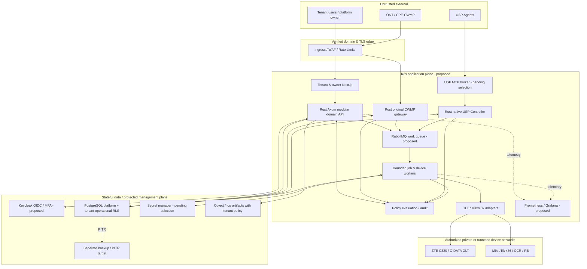
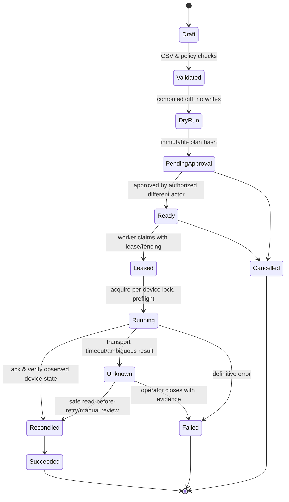

# IPAT — Technical Architecture v0.1

**Tanggal:** 2026-09-25 · **Status:** approved constraints + proposed implementation detail (lihat `DECISIONS.md`)  
**Cakupan:** MVP laboratorium → arsitektur komersial terukur. Ini **rancangan**, bukan bukti komponen sudah berjalan.

## 1. Architecture principles dan boundaries

1. Original Rust ACS CWMP server dan native Rust USP Controller adalah dua proses/protocol boundary berbeda; tidak menggunakan GenieACS sebagai engine. Shared `device-core` menyimpan identitas, capability dan job abstraction yang tidak berpura-pura kedua standar identik.
2. Business logic dimulai sebagai **modular monolith** Rust/Axum + deployable protocol services (`cwmp-gateway`, `usp-controller`) dan worker (`job-worker`); jangan membelah seluruh domain menjadi microservice.
3. Strong tenant context end-to-end: `auth subject + verified tenant membership + resource assignment + policy decision`. Tenant host/domain adalah *routing hint* yang diverifikasi di edge, bukan bukti otorisasi atau kepemilikan perangkat. Control plane platform dan data plane operasional tenant dipisahkan.
4. Retry adalah *at least once* transport; output perubahan perangkat tidak otomatis exactly once. Gunakan transactional outbox, idempotency, distributed lease/fencing dan `reconcile-before-retry`; unknown outcome → intervensi operator.
5. K3s menambah/mengurangi compute capacity lintas VPS/bare-metal heterogen. Stateful PostgreSQL HA dan object/backup storage adalah proyek berbeda. Scaling tidak berarti distribusi CPU sama atau kenaikan throughput linear.
6. Read-only sebelum write adapter; capability/validation per exact model+firmware+feature+protocol, approval dan audit pada write.

## 2. Context dan trust-boundary diagram



**Logical boundaries:** public HTTPS UI/API vs dedicated protocol ingress; authenticated MQTT transport proposed for USP; device-management egress restricted by tenant/device network allowlist; database and secret plane not exposed publicly; admin of platform and tenant interfaces are separate authz namespaces. Tenant dashboard subdomain contoh `kangnet.ipat.id`/`nengnet.ipat.id` adalah ilustrasi **tanpa asumsi kepemilikan domain**.

## 3. Repository & deployable units (planned; none claimed implemented)

```text
ipat/
├── README.md
├── Cargo.toml                          # Rust workspace
├── apps/
│   ├── control-api/                   # Axum business domain modular monolith
│   ├── cwmp-gateway/                  # original CWMP Rust HTTPS/SOAP server
│   ├── usp-controller/                # native USP protobuf/controller
│   └── job-worker/                    # poll outbox/consume queue, adapter execution
├── crates/
│   ├── tenant-core/                   # canonical verified TenantContext
│   ├── authz-core/                    # RBAC/ABAC policy evaluator
│   ├── device-core/                   # IDs, capabilities, normalized observations
│   ├── provisioning-core/            # state machine + approval + idempotency
│   ├── inventory-core/               # subscriber/topology model
│   ├── diagnostic-core/              # evidence and deterministic rules
│   ├── cwmp-protocol/                # SOAP/XML, CWMP state machine
│   ├── usp-protocol/                 # protobuf schema, MTP boundary
│   ├── adapters-zte/
│   ├── adapters-cdata/
│   ├── adapters-mikrotik/
│   ├── persistence/
│   └── observability/
├── web/                                # Next.js TypeScript (proposed)
├── migrations/                         # PostgreSQL + RLS + audit + outbox
├── proto/                              # reference-pinned USP schemas
├── tests/                              # unit, integration, policy-negative, e2e, sim, physical
├── deploy/
│   ├── compose/                        # lab only
│   ├── ansible/                        # Ubuntu/K3s bootstrap
│   ├── terraform/                      # optional supported providers
│   ├── helm/                           # app manifests, requests/limits
│   └── gitops/                         # desired state manifests
└── docs/                               # source of truth
```

**Shared crate ≠ single process:** identity/capabilities/policy API compiled into several Rust workloads, yet config boundaries enforce least-privilege service identities. Circular dependencies dilarang: protocol crates bergantung pada device-core/traits, bukan domain API HTTP; adapters mematuhi `DeviceAdapter` capability contract.

## 4. Tenant model, auth, routing dan database

### 4.1 Domain dan trust chain

1. Ingress menerima request hanya untuk domain pada `verified_tenant_domains`, sertifikat dan routing record yang dimiliki; perpanjangan sertifikat dan takeover prevention diuji. Header `Host`/`X-Forwarded-*` dianggap tidak terpercaya bila tidak diterbitkan trusted ingress.
2. Sesi OIDC JWT yang diverifikasi (`iss`, `aud`, signature, expiry/nbf, session context) → membership tenant pada DB/policy → `TenantContext` immutable (`tenant_id`, actor, scopes, POP, auth strength, correlation ID). User tidak dapat mengirim `tenant_id` bebas untuk menambah scope.
3. Domain mapping wajib konsisten dengan membership; cross-domain login harus memilih tenant melalui proses terotorisasi. Custom-domain cookie **host-only**, CSRF protected dan OIDC return URI allowlisted. UI menyembunyikan menu via server-supplied filtered entitlement, tetapi setiap endpoint/API/export/job tetap re-evaluate policy.
4. Platform owner bukan `super tenant`. Support access untuk tenant membutuhkan permintaan+approval scope/time-bound dan logging plus pemberitahuan sesuai kontrak; secret akses lebih ketat.
5. Service-to-service menggunakan mTLS/network policy bila dimungkinkan, service identity/audience terpisah serta signed tenant provenance (bukan semata queue payload); worker membaca job dari DB dan memverifikasi ulang resource+policy.

### 4.2 Candidate v0.1 tenant persistence — **PROPOSED ADR-005**

- PostgreSQL logical platform schema mengelola tenants, domains, plans, entitlements, operator grants. Tenant operational tables (`devices`, `observations`, `subscribers`, `topology_edges`, `jobs`, `incidents`, `audit_events`) memakai `tenant_id NOT NULL`, scoped FK dan indexes `(tenant_id, ...)`. Jangan memungkinkan relasi lintas tenant melalui foreign key ID global tanpa verifikasi.
- App connection pool memakai runtime role tanpa superuser/BYPASSRLS dan bukan owner; `ENABLE`+`FORCE ROW LEVEL SECURITY` di tiap tabel tenant. Transaction-scoped `SET LOCAL app.tenant_id = ...` hanya setelah membership diverifikasi, hindari leakage koneksi pool. RLS denial bila tenant setting tidak valid/absent. `SECURITY DEFINER` dipakai sangat terbatas dan diaudit.
- Simpan audit multi-tenant pada storage/log terfilter; `COPY`, exports, full-text search, derived materialized views, task payload dan restore punya tenant isolation sendiri. `pg_dump`/backup fisik mencakup banyak tenant: kontrol akses backup ketat, segment/restore/redaction setelah insiden dan opsi tenant-dedicated DB dievaluasi.
- Saat tenant skala besar atau isolasi kontrak mengharuskan, pertimbangkan migrasi tenant ke database/cluster khusus melalui storage abstraction & per-tenant routing. Kompleksitas migration/cost menjadi alasan pola shared+RLS masih *pending decision*.

**Indicative pseudocode** (bukan migration siap jalan):

```sql
-- Illustrasi: migrate menggunakan role khusus, runtime role terpisah.
ALTER TABLE tenant_devices ENABLE ROW LEVEL SECURITY;
ALTER TABLE tenant_devices FORCE ROW LEVEL SECURITY;
CREATE POLICY tenant_scope ON tenant_devices
  FOR ALL TO ipat_app_runtime
  USING (tenant_id = NULLIF(current_setting('app.tenant_id', true), '')::uuid)
  WITH CHECK (tenant_id = NULLIF(current_setting('app.tenant_id', true), '')::uuid);
-- DAL wajib SET LOCAL dari tenant context yang sudah diverifikasi, bukan header.
```

Uji *owner bypass*, `BYPASSRLS`, prepared statement/transaction pooling, invalid UUID handling dan `SET LOCAL` rollback. RLS tidak melindungi superuser/owner kecuali FORCE, serta operasi tertentu seperti TRUNCATE memerlukan kontrol GRANT terpisah.

### 4.3 Core data model (concept)

| Entitas | Kunci minimal | Invariant |
|---|---|---|
| `tenants` | `id`, `state`, `plan_id` | Hanya control-plane dapat membuat/menangguhkan |
| `tenant_domains` | `tenant_id`, `fqdn`, `verified_at`, `challenge_ref` | Unik secara global, mapping verified sebelum routing |
| `devices` | `id`, `tenant_id`, `kind`, `vendor`, `exact_model`, `firmware`, `status` | Identitas/credential dan ACS/USP agent harus terikat pada tenant |
| `device_protocol_identities` | `device_id`, `tenant_id`, `protocol`, `protocol_identifier`, `credential_ref` | Unique semantics scoped oleh tenant & protocol; collision ditolak |
| `capability_validations` | `vendor`, `model`, `firmware`, `protocol`, `feature`, `status`, `evidence_ref` | Tidak ada dukungan global hanya karena vendor cocok |
| `subscribers` | `id`, `tenant_id`, `customer_ref` | Data pelanggan adalah PII; akses per POP/subscriber |
| `topology_edges` | `tenant_id`, `from_id`, `to_id`, `source`, `observed_at` | Dua endpoint sama tenant; evidence dan freshness |
| `observations` | `tenant_id`, `device_id`, `metric`, `value`, `observed_at`, `ingested_at`, `source` | Bedakan source time vs ingest time, stale bukan offline pasti |
| `jobs` | `tenant_id`, `resource_id`, `state`, `idempotency_key`, `lease_owner`, `fencing_token`, `approval_id` | Unique scoped idempotency dan provenance |
| `outbox` | `tenant_id`, `event_id`, `payload_ref`, `published_at`, `attempts` | Commit pada transaksi yang sama dengan job |
| `approvals` | `tenant_id`, `requested_by`, `approved_by`, `scope_hash`, `expires_at` | Separation of duties, approval melekat pada diff immutable |
| `incidents/evidence` | `tenant_id`, `scope`, `hypothesis`, `sources`, `ages` | Hipotesis bukan fakta tanpa evidence |
| `audit_events` | `tenant_id` (nullable hanya platform operations), `actor`, `action`, `outcome`, `correlation_id` | Append-only/write restricted dan redacted |

Partisi telemetry/time-series dan alat eksternal belum dipilih; sebelum retensi panjang, ukur kapasitas PostgreSQL vs observability store serta backup blast radius.

## 5. Protocol details dan alur

### 5.1 ACS/CWMP TR-069 (native Rust)

- Axum HTTPS endpoint khusus protocol; validasi TLS, content type/size, secure XML parser (no DTD/external entities, entity limits), SOAP faults dan session timeouts. **TR-069 Amendment 6 Corrigendum 1** menjadi referensi standar yang *in force*; pilih subset RPC berdasarkan tes, jangan mengklaim implementasi seluruh amendment.
- CWMP Inform memuat identitas CPE/events, tetapi `SerialNumber`, MAC, remote IP, hostname atau realm saja bukan bukti tenant. Untuk perangkat pradaftar: kombinasi unique ID per manufaktur/OUI/ProductClass/serial dan credential auth/issued enrollment binding diverifikasi terhadap tenant. Collision/quarantine → tidak auto-assigned. Enrollment harus aman untuk perangkat yang belum mendukung metode ideal.
- State: authenticate → check device/tenant → open session/record Inform → InformResponse → schedule one eligible RPC following CWMP session rules → process response/fault → close/expire session. Distribusi session ownership antarpod harus desain eksplisit sebelum scaling ACS; jangan meletakkan koneksi aktif *hanya* pada DB.
- Feature baseline: Inform/InformResponse dan satu operasi parameter (misalnya GetParameterValues pada path yang **diuji**). Metode/versi/batasan dicatat di `DEVICE_MATRIX.md`, tidak hard-code path universal TR-098/TR-181 pada semua CPE.
- Control-plane `cwmp_inform_total`, session age, RPC failures per profile, concurrent sessions, invalid auth, queue latency. Connection Request/NAT/discovery upgrade dibahas setelah physical validation.

### 5.2 USP/TR-369 native Controller

- Modul sendiri (agent identifiers, controller identity, USP Record/Message protobuf, E2E correlation, replay/authorization, transport adapters) dan trait mapping ke normalized device model. Current reference target **TR-369 Amendment 5**; feature profile diputuskan ADR karena agen lab bisa implementasi amendment lebih lama.
- Initial MTP candidate MQTT yang diamankan dengan TLS, ACL topic per Controller/Agent dan credential/lifecycle; **MQTT broker dan RabbitMQ work queue adalah dua fungsi berbeda** walaupun produk mungkin berbagi teknologi bila dibuktikan aman. Broker/MTP tetap PROPOSED hingga threat test dan interoperability.
- Proof flow S1: synthetic/compatible Agent authenticated connect → Controller identification → Get atau Notification satu pesan → correlation dan observation → audit; jika simulator saja, tandai `simulator-only` dan jangan klaim device supports USP.
- Tenant binding datang dari trusted enrollment dan broker identity + per-agent mapping, bukan topic user-controlled. Session/reconnect/duplicate/out-of-order, schema evolution dan access control ditangani M1/M2.

### 5.3 OLT, MikroTik, ONT adapters

- Adapters exposed `discover()`, `observe()`, `capabilities()`, `plan_change()`, `execute_approved()`; write capability **default false**, bergantung evidence exact tuple model/firmware/feature dan privilege.
- OLT ZTE C320/C-DATA: SNMP dan vendor channel *candidate*, tentukan MIB/CLI/API berdasarkan akses nyata; telemetry read-only dulu. Jangan menyimpulkan semua OLT C-DATA/firmware sama. VSOL GPON OLT di luar confirmed pilot.
- MikroTik x86/CCR/RB/RB pelanggan: per RouterOS version pilih `api-ssl` atau REST over `www-ssl` jika tersedia; trust sertifikat dan allowlisted device subnets, credential tenant-specific; larang plaintext fallback di staging/production. PPPoE secret/session read scoped dan limited write.
- No unexpected high-risk commands; preview diff/rollback plan untuk per-command yang memungkinkan, emergency stop dan blast-radius caps (maks router/device/subscriber per batch) ditetapkan security policy.

## 6. Provisioning transaction/state machine dan side-effect safety



1. API transaction menyimpan immutable diff/plan hash, actor/approval dan job+outbox pada PostgreSQL atomik; outbox dispatcher publish minimal once dan mencatat ack tanpa menghapus provenance.
2. Worker menerima pesan berupa opaque `job_id` + correlation ID; mengambil job & resource/approval dari DB (jangan percaya tenant_id hanya dari queue). Claim atomik (`lease_owner`, expiry, monotonic `fencing_token`), per-device lock, max concurrency per adapter, per-router throttle.
3. Sebelum write: check policy+approval expiry/immutable plan hash, model/firmware exact capability, maintenance window dan current state; setelah write, verify state/sanitized evidence; `applied` hanya bila terverifikasi.
4. Worker yang lease-nya kedaluwarsa harus diblokir dari *commit state* via fencing token. **Catatan:** fencing DB tidak otomatis menghentikan perintah yang telanjur dikirim ke perangkat; pada timeout outcome `Unknown` perlu reconciliation/read-back/manual review untuk mencegah side-effect ganda. Klaim exactly-once end-to-end tidak sah tanpa dukungan transaction/idempotency perangkat.
5. RabbitMQ ack sesudah state durable; duplicate delivery mengarah ke pemeriksaan `idempotency_key` dan state, tidak mengirim perubahan ulang jika state sukses/sedang unknown. Dead-letter + incident pada retry limit, manual replay memerlukan otorisasi.

## 7. Diagnostics engine dan data provenance

Event input: physical/logical uplink status, OLT/PON/ONT signal/alarm, CPE Inform dan parameter, PPPoE active/error, router interface/counters, topology edges dan maintenance data. Normalizer simpan `source`, `observed_at`, `ingested_at`, `confidence_of_source`, `freshness_policy`, missingness dan contradictions.

**Rules baseline S1 (synthetic, bukan akurasi lapangan):**

- R-DIAG-01: distribusi uplink failed + lebih dari satu downstream device/subscriber terpengaruh → *distribution-path hypothesis*, timestamp bukti dan daftar dampak.
- R-DIAG-02: satu ONT optical LOS + uplink/neighbor sehat → *ONT/PON access hypothesis*; jangan menyatakan fiber putus tanpa corroboration.
- R-DIAG-03: PPPoE auth/session fails dengan optical/transport bukti normal → *router/PPPoE hypothesis* dan evidence.
- R-DIAG-04: hanya tidak ada CWMP Inform → status *insufficient evidence*, tidak boleh otomatis *fiber cut*.

Tampilan memisahkan observasi aktual vs inferensi, provenance/age dan severity serta memberi manual review; tuning prediksi tidak termasuk S1.

**R5.2 synthetic implementation:** `crates/diagnostic-core` enforces exact `TenantId`/POP/path on normalized observation batches, bounded event timestamps, positive multi-source prerequisites and contradictory-source/operator-review status. A caller-owned `topology_verified` assertion must come from an authorized future topology store; it is not trusted from device payloads or headers. No real device signal ingestion, calibrated inference or remediation exists yet. [Implementation/test scope](DIAGNOSTICS_R52.md).

## 8. K3s & heterogeneous scale path

**Lab single node:** Ubuntu 26.04 LTS 16 vCPU, 64 GiB-class RAM, ~1 TB NVMe baseline *provisional* + backup eksternal. Docker Compose test optional (tidak dijadikan production HA). K3s single-server/dev untuk menguji charts/resource policy; database awal lokal/dev bukan HA.

**Second node:** Ansible OS prep → private VPN/link → K3s join with time-bound join secret (never Git) → label `node.kubernetes.io/instance-type`/capacity/role, requests & limits → pod/worker eligible schedule → drain/restore test. Control-plane join dan datastore options diputuskan berdasar jaringan, host diversity dan db architecture. Tidak menjanjikan distribusi CPU ideal.

**Scale signals:** queue depth **dan oldest age**, in-flight jobs, per-device concurrent slots, CPU/memory/network, DB connection/writes, CWMP sessions, USP agents broker load, instrumented p95 latencies. HPA untuk API bila terbukti stateless; KEDA untuk workers dari queue setelah ready/admission gate. Backpressure berupa bounded concurrency, tenant budgets, circuit breakers, dead-letter, global controls; autoscale tidak mengatasi bottleneck PostgreSQL/device rate limits.

**Production:** redundant ingress/control-plane, isolated DB primary/standby and PITR/backups; broker HA, secrets, metrics HA/retention and regional egress tested. Architecture dan harga final pascaukuran; heterogeneous VPS dapat berbeda CPU steal/I/O sehingga monitor allocatable, actual core performance dan noisy-neighbor.

## 9. Availability, disaster recovery, operations

| Plane | S1 design | Commercial requirement |
|---|---|---|
| App | Single-node K3s dev atau compose | Multi-node, anti-affinity, readiness/liveness, rolling deploy, graceful drain |
| Postgres | Single lab, per-run backups and actual restore | Separated primary/standby, failover tested, WAL archiving/PITR, offsite encrypted tested backups |
| Queues | RabbitMQ dev single | Durable jobs + outbox, HA design/alert, DLQ and replay runbook |
| USP MTP | Broker TBD simulator | MQTT broker redundancy if selected, identity/ACL/observability |
| Secrets | Dummy/secure dev store | External managed vault/KMS with rotation/revocation and audited read |
| GitOps | Planned manifests | Signed artifacts, reviewed deploy, rollout/rollback and config drift reporting |

Runbooks dalam `DEPLOYMENT.md`: bootstrap/join/validate/drain/remove/restore; backup validation, incident classification, compromised credential, per-tenant isolation incident dan emergency stop. **RPO/RTO mesti diusulkan lalu dibuktikan** sesuai plan komersial.

## 10. ADR dan hal belum ditetapkan

- `ADR-001..004` adalah binding brief (original ACS, native USP, architecture form, Ubuntu/Rust/K3s).
- `ADR-005` shared operational PostgreSQL + RLS versus schema/database-per-tenant: **PROPOSED**, pilot security/load test diperlukan.
- `ADR-006` Next.js/Keycloak/RabbitMQ/Prometheus/Grafana: **PROPOSED** component bundle, review dependencies/licensing/deployment cost.
- `ADR-007` USP MQTT MTP and broker: **PROPOSED**; validate A5 feature subset/agent versions/security.
- `ADR-008` secret manager/object storage/telemetry partitions/data retention: **OPEN**.
- `ADR-009` high-risk approvals, domain trust model and separation of platform control plane: constraint approved; workflow detail **PROPOSED**.
- `ADR-010` PostgreSQL HA/failover/RPO/RTO and secondary-region backups: requirement approved, topology/vendor values **OPEN**.

## 11. Reference versions and external technical references (checked 2026-09-25)

- [Broadband Forum technical library — TR-069 Amendment 6 Corrigendum 1 *in force*](https://www.broadband-forum.org/technical-library/?Type%5B0%5D=Technical+Report&sort=InForce&type=asc); protocol subset must be enumerated in tests.
- [Broadband Forum technical library — TR-369 Amendment 5 *in force*](https://www.broadband-forum.org/technical-library/?number=TR-369); [USP official repository v1.5 release metadata](https://github.com/BroadbandForum/usp/blob/master/PROJECT.yaml).
- [Broadband Forum technical library — TR-181i2a21 (2026/06)](https://www.broadband-forum.org/technical-library/) as data model reference, not a claim of agent capability.
- [Ubuntu 26.04 LTS release notes](https://documentation.ubuntu.com/release-notes/26.04/).
- [PostgreSQL RLS documentation](https://www.postgresql.org/docs/current/ddl-rowsecurity.html): FORCE RLS and owner/superuser/BYPASSRLS caveats.
- [MikroTik RouterOS REST API documentation](https://manual.mikrotik.com/docs/developer-guides/rest-api/) and [RouterOS API](https://manual.mikrotik.com/docs/developer-guides/api/)—feature availability must be measured per device/RouterOS.
- [KEDA scaling deployments reference](https://keda.sh/docs/2.21/concepts/scaling-deployments/). Pin actual versions during implementation with SBOM and compatibility tests.

**Verification reminder:** Referensi menjelaskan standar/platform fitur yang tersedia, **tidak** membuktikan keberhasilan implementasi IPAT maupun kompatibilitas fisik OLT/ONT/MikroTik.


## R4.8 optional native host firewall boundary — PROPOSED, not deployed

Per [vendor-neutral firewall architecture and safety gates](FIREWALL_CONTROL_PLANE.md), IPAT may offer an optional first-party Ubuntu host firewall management capability. It will NOT integrate with external hosting-provider security-group or managed-firewall APIs. The first Rust `firewall-policy` crate is pure in-memory **dry-run validation only**; no root agent, nftables transaction, UI API, approval workflow, cluster CNI integration or production deployment is implemented.

Proposed trust chain: platform operator identity (OIDC/MFA) → verified platform-host assignment → RBAC+ABAC deny-by-default policy → immutable candidate diff → dual maker/checker approvals for high-risk changes → time-bounded signed host-scoped request → dedicated root-isolated IPAT nftables agent (later) → safe atomic update of **only IPAT-owned chain/table** after backup, independent console/rollback tests → new independent IPv4/IPv6 verification → protected audit evidence. Tenant operators must never inherit platform host firewall privileges; no kernel socket/capability is exposed to tenant workloads.

**K3s caveat:** independent host nftables rules must coexist with the actual chosen K3s CNI and iptables-nft behavior. Do not flush global rules, configure forwarding blindly, or claim that the Rust planner secures node networking. Kubernetes NetworkPolicy and per-device transport authentication remain distinct controls. ADR-018 is PROPOSED and ADR-017 still OPEN.


## R4.9 offline native CWMP admission implementation (no public listener)

`crates/cwmp-admission` is a separate pure domain module between the existing bounded `cwmp-protocol` parser and a **future** original Rust `cwmp-gateway` mTLS network adapter. It binds synthetic enrolled device identity (OUI + ProductClass + SerialNumber), fixed tenant and pinned client-SPKI SHA-256 *only after* a sealed `AuthenticatedPeer` proof; no request header or SOAP claim can construct this proof. The module bounds in-memory enrollment/active leases/replay and emits an `InformResponse` only on successful admission. It is synthetic-test-only until real TLS certificate validation, authenticated operator enrollment, durable session/replay semantics, timeouts and standards-tested RPC handling are implemented. See [R4.9 exact tests and gaps](CWMP_ADMISSION_R49.md). Native USP Controller remains independent and mandatory (ADR-002).


## R5.0 native USP Controller process and synthetic test boundary

`crates/usp-core` now exists as a **separate** Rust synthetic domain module, with no coupling to CWMP parser internals. It binds a test-only sealed agent transport proof + trusted operator proof to an explicitly enrolled endpoint and tenant, creates bounded read-only plans, and correlates only verified synthetic replies. `apps/usp-controller` is a separate Rust Axum process that has **only an optional loopback health route**; all other routes deny. It does not yet use `usp-core` for any real USP messages because **no standards-pinned protobuf schema or cryptographically validated MTP** has been selected. MQTT remains proposed by ADR-007. Never map a public socket to this module or claim real TR-369 support from a generic synthetic correlation test. [R5.0 implementation boundaries](USP_SYNTHETIC_R50.md).

## R5.3 offline provisioning-job safety slice
`crates/provisioning-core` is an in-memory, **non-executable** simulation of bounded tenant-scoped dry-run proposals, exact idempotency, independent synthetic checker approval, fenced leases and global per-router serialization. Verified actor/worker proof constructors do not exist in production; no database, broker, RouterOS transport or API route uses it. Lease expiry yields `Unknown` and quarantines the router for future audited reconciliation, never an automatic retry or fail-open router unlock. This is preparation for S1-03, **not** a transactional outbox, cross-process lock, trusted MFA/OIDC identity or an actual write gate. See [scope and evidence](PROVISIONING_SIMULATOR_R53.md).

## R5.4 disposable SQL job/outbox persistence slice
Lab-only `deploy/db/migrations/0002_lab_job_outbox.sql` extends R5.1 with POP+tenant scoped synthetic jobs and event outbox, immutable idempotency/digest, same-tenant/POP router reference, FORCED RLS, read-only runtime access, bounded synthetic state-transition triggers and a partial global unresolved-router UUID uniqueness index. An AFTER trigger writes an outbox event atomically in the same transaction. No trusted OIDC/POP claim verifier, authenticated actor/worker mapping, live database pool, real queue publisher or RouterOS executor exists. The SQL harness is privileged in disposable CI, not an approved application mutation channel. Global UUID uniqueness is not verified hardware ownership. See [R5.4 precise lab scope](POSTGRES_JOB_OUTBOX_R54.md).

## R5.6 K3s target-OS disposable validation
The project now has a deliberately short-lived GitHub Actions Ubuntu **26.04** native K3s single-node experimental profile, `deploy/scripts/lab/k3s-ubuntu26-ephemeral-ci.sh`. It verifies the upstream pinned non-prerelease binary checksum and aims to measure real embedded-etcd K3s node/cluster-DNS/pod and local snapshot behavior, with no persistent systemd install, public ingress or live VPS changes. This is **not** ADR-017 production CNI/datastore approval: public IPv4/IPv6 source restrictions, cross-provider encrypted private node overlay, at-least-three-host failure-domain quorum and off-host datastore restoration remain to be designed and demonstrated independently. See [R5.6 experiment](K3S_UBUNTU26_R56.md).

## R5.7 K3s recoverability evidence boundary
R5.7 demonstrates a real checksum-pinned K3s systemd source node on disposable Ubuntu 26.04 QEMU, transfer of an embedded-etcd snapshot plus original root-only server token to a distinct disposable VM, official cluster-reset restore, stale source Node/pod reconciliation, fresh workload DNS, systemd restart recovery and post-restore snapshot. A separate real nftables drill verifies an IPAT-owned table can coexist with K3s and automatically roll back an intentionally SSH-blocking rule with a one-second-accuracy timer. These are laboratory recovery primitives only. QEMU user networking is not the selected production overlay; multi-node quorum, storage classes, persistent volumes, provider-isolated routes and ADR-017 remain unresolved. Live K3s deployment therefore remains blocked independently of the successful disposable recovery evidence.

## R5.8 synthetic K3s app packaging (not production)
A single disposable Ubuntu 26.04 embedded-etcd K3s node (R5.6) will build and import the existing `control-api` and independent `usp-controller` offline synthetic Rust HTTP binaries as separate static-musl, scratch, non-root pods. Two private ClusterIP Services and smoke-pod-only NetworkPolicies have no external exposure, data storage, USP MTP, real OIDC or customer-device I/O. Rendered manifests are strictly validated prior to ephemeral Helm install. This is an application orchestration test only; HA topology and private CNI selection remain ADR-017 OPEN. See [R5.8 scope](K3S_APPLICATION_PACKAGING_R58.md).

## R5.9 private web preview boundary (PROPOSED production frontend unchanged)

The original Rust Control API now optionally embeds a read-only, static
first-party laboratory overview (`web/lab`) when explicitly enabled by
`IPAT_LAB_WEB=1` **and only with its default loopback network bind**. It does
not implement multi-tenant identity, login or any subscriber/device operations.
Its separate K3s bind mode forcibly disables these unauthenticated preview
routes. A key-only SSH tunnel to the authorized Mac, bound to localhost on
both sides, is the only supported preview access. The production frontend
technology and domain/OIDC architecture remain PROPOSED ADR-006/OPEN ADR-014;
a local demo is not a final Next.js/tenant-session decision.

## R6.0 project hardware candidate inventory (not a runtime device connector)

The original Rust Control API gains a strictly opt-in SSH-loopback-only
read-only static test-target catalog at `GET /lab/device-targets`. It
records exactly the approved eight initial *candidate families* as
`awaiting_metadata`, zero actual physically enrolled devices, zero
interoperability proof, and no automatic network discovery or privileged
actions. K3s pod-bound and default HTTP routers cannot serve the catalog.
The frontend uses text-only DOM rendering and refuses inconsistent provenance.
An independent offline private Python validator stages exact-model/firmware
metadata outside Git; it does NOT grant network access, tenant enrollment,
API authentication or any implicit compatibility claim. Production inventory
requires trusted OIDC + resource-level RBAC/ABAC, verified tenant/device
identities, per-feature hardware test evidence and isolated access.

## R6.1 exact customer MikroTik first-read boundary

DEV-08 is owner-reported as RB951Ui-2HnD / RouterOS 7.23.7;
its claim remains unverified until a scoped, approved *physical*
read succeeds. A separate single-purpose Python lab probe is
**not** the production Rust RouterOS device adapter. It defaults
offline, only permits a manually selected RFC1918 IP to a fixed
HTTPS port, verifies an independently specified TLS DNS name against
a private trusted CA, loads dedicated credentials from a local
mode-0600 netrc, and makes one GET of /rest/system/resource.
The output is strictly allowlisted and only owner-private evidence,
not automatic tenant enrollment. The browser remains
SSH-loopback-only and never contains management IPs or credentials.

## R6.2 Rust RouterOS read-only domain (NOT a driver)

`crates/routeros-core` becomes the typed Rust offline normalization
boundary for the first specifically owner-reported DEV-08 RB951Ui-2HnD
/ RouterOS 7.23.7. It can parse only bounded /rest/system/resource
objects, reject duplicate/oversized/ambiguous model+firmware, and
discard unknown device fields including secret/serial/address data.
The `UnreviewedInventory` type has no constructors granting
authorization, verified tenant assignment or device writes.
A separate `evidence` validator permits exactly the private redacted
R6.1 Python first-GET output schema but **cannot authenticate that
the GET occurred**. The local non-network CLI validates syntax only.
No new HTTP route, privileged driver or Kubernetes listener is
introduced; real device integration remains subject to independent
verified identity, OIDC+RBAC/ABAC, approvals and physical lab evidence.

## R6.4 lab-only SSH first read, distinct from production RouterOS network adapter

The separately executable Python laboratory helper
`deploy/scripts/lab/r64/ssh-first-read.py` prepares a
**single known-device key-only, strict-host-pinned, one-read**
candidate for DEV-08, only after separate direct-LAN identity
proof, backup/recovery, time-limited restricted account and
three independent owner opt-ins. It is disabled until
those human-controlled prerequisites are met. A temporary
one-host known_hosts key must match the separately verified
SHA-256 fingerprint and NEVER alters the Mac's historical
known_hosts record. The existing modular Rust domain
`routeros-core::evidence` accepts the new strictly scoped
SSH evidence tuple and all unverified privilege flags remain
false; no network connector was added to the production
Rust Control API. The loopback-only browser shows a STATIC
security-blocker snapshot from the reviewed one-host
unauthenticated SSH check, not a live router session.
Production trusted tenant binding remains a separate
architecture/milestone prerequisite.

## R6.6 current original Rust CWMP implementation vs release blockers

The original Rust ACS boundary has three pieces:
`cwmp-protocol::rpc` bounds and parses one synthetic
SOAP 1.1/CWMP 1.0 read RPC; `cwmp-admission::read`
extends the existing synthetic, nonconstructible
`AuthenticatedPeer` + opaque `Lease` with
Inform → InformResponse → true empty CPE POST
→ one fixed read RPC → correlated response/fault
→ close/abort. Returned raw parameter values
never enter redacted `ReadEvidence`. A separate
`apps/cwmp-gateway` executable is an opt-in
127.0.0.1:3300 **parser-only** lab HTTP boundary;
its real `/cwmp` path always denies HTTP 503
until trusted network binding exists. The lab
parser route cannot construct synthetic trusted
peers or enroll any device. The real executable
is useful for ingress XML/HTTP rejection tests,
not proof of CPE interoperability.

Future ACS adapter MUST perform genuine HTTPS
TLS server identity and independent CPE client
certificate chain/expiry/revocation/SPKI
verification, fetch trusted operator enrollment

under authenticated tenant binding, and mint
the sealed Rust peer type ONLY after these
checks, never from headers or CWMP XML.
For authentic CWMP HTTP binding, the ACS
returns one RPC as the HTTP response to
the CPE empty POST; a later CPE HTTP POST
delivers the correlated SOAP response/fault.
This state needs durable tenant-scoped
replay/session ownership, timeout, crash
recovery, bounded retries, source and
resource budgets and audited secret-safe
read retention before any ingress exposure.
The current lab in-memory engine has none
of these production properties. Native USP
Controller is still an independent service.
See [R6.6 exact tested scope](ACS_CWMP_R66.md).

## R6.7 bukti transport mTLS asli tetapi belum mendapat identitas tenant

Satu proses original Rust baru
`apps/cwmp-gateway/src/bin/cwmp-mtls-lab.rs`
mendemonstrasikan mTLS TLS 1.3 nyata memakai
`rustls::server::WebPkiClientVerifier`
dengan satu CA laboratorium dan kewajiban
sertifikat klien. Ini gateway **hanya loopback**
untuk membuktikan handshake, bukan jalur ACS
produksi. Konfigurasi secara eksplisit menolak
root, sertifikat/kunci tidak aman, dan
default tidak dapat memulai listener.
HTTP POST SOAP Inform yang melewati mTLS
tetap hanya parser sintetis, tanpa
`AuthenticatedPeer`, tenant/session
assignment, InformResponse atau RPC.
Seluruh `/cwmp` selalu ditolak (503).
`cwmp-admission` dan parser asli R6.6
tidak diubah semantiknya, demikian pula
native USP Controller tetap proses terpisah.

Tahap berikutnya adalah komponen
transport terautentikasi yang *memiliki*
pemrosesan TLS handshake yang benar

dan memetakan leaf SPKI yang benar
kepada enrollment persisten yang
telah disetujui operator dengan
tenant tervalidasi, tanpa jalur
membuat `AuthenticatedPeer`
dari header atau klaim SOAP.
Mempunyai client cert dari satu
CA tidak cukup untuk memutuskan
otorisasi tenancy. Revocation/CRL,
handshake throttle dan session
recovery belum diuji untuk beban
nyata. Lihat [lingkup R6.7](ACS_MTLS_R67.md).

## R6.8 presentasi tiga dashboard bukan identitas tiga tenant

Frontend saat ini baru satu
**proses nonroot private preview**
`control-api` berbasis Rust/Axum
yang menampilkan varian Platform,
Tenant dan NOC dari fixture
sintetis lokal. Pemilihan
tampilan melalui JavaScript
hanya untuk menguji informasi
dan UX, **tidak menentukan
hak akses**. API nyata
`/v1/platform/*`, `/v1/tenant/*`
dan `/v1/operations/*`
tetap mengembalikan 401
untuk semua permintaan sampai
OIDC dan tenant membership
tepercaya dibangun. Serving
aset /lab/dashboard-preview
hanya diaktifkan pada
non-K3s loopback + tunnel.
`authz-core::dashboard`
memiliki kebijakan pure
platform-metadata vs

tenant/POP yang ditujukan
bagi server-side entitlement
setelah konteks pengguna
diverifikasi dari IdP+DB.
Jangan menautkan selector
browser ke entitlement,
atau menganggap policy
pure sebagai middleware
autentikasi yang tersedia.
Lihat [R6.8](DASHBOARDS_R68.md).

## R6.9 identity boundary for Platform, Tenant and NOC dashboards

Original Rust `crates/identity-core` verifies one trusted
operator-pinned issuer/audience/RSA key ID and genuine RS256 JWT
signature with bounded time/size. The signer public key is supplied
separately through trusted owner-local configuration, never from
an incoming JWT's JOSE `jku`, `jwk`, `x5u` or HTTP headers.
The resulting opaque `VerifiedSubject` contains ONLY subject
and expiry, not tenant membership, administrator role,
POP authorization or MFA evidence.

`apps/control-api/src/oidc_lab.rs` demonstrates this signature
boundary only behind the existing privately opted-in
127.0.0.1:3000 lab; `GET /lab/auth/verify` returns a
redacted success response that explicitly denies
verified tenant membership and all business access.
The normal public/K3s router does not have that lab
route. ALL real Platform/Tenant/NOC business APIs
still reject with 401 even if bearer signature succeeds
and attacker-controlled tenant/role headers are supplied.

Next separate production architecture work: independently
validate Keycloak discovery over trusted TLS, maintain

rotating trusted issuer JWKS and client audience,
perform Authorization Code+PKCE and MFA/session binding;
query verified tenant and POP membership in database
and apply policy at server-side menu and every resource
API plus PostgreSQL RLS. No architecture proposal
becomes approved automatically through this
synthetic implementation.
[Detailed R6.9 scope](IDENTITY_OIDC_R69.md).

### R7.0 keanggotaan kandidat dan batas sumber kepercayaan

Migrasi sintetis
`0003_lab_identity_memberships.sql`
menyiapkan tiga tabel platform:
`identity_memberships` (exact tenant,
issuer, subject, role yang disetujui),
`identity_pop_grants` (exact tenant,
issuer, subject, role + POP melalui FK)
dan `platform_principals` (role pemilik
platform tanpa otomatis keanggotaan
perusahaan). Semuanya FORCE RLS tanpa
akses role `ipat_app_runtime`. Tidak
ada endpoint lookup, operator approval
service atau database live baru;
data seed hanya identitas contoh.
Skema ini belum keputusan
ADR-005 maupun alur OIDC nyata.

Batas berikutnya harus memilih
operator/persetujuan melalui OIDC
tepercaya; memetakan verified subject
ke membership aktual lewat DB
dengan audit, expiry, revoked
dan MFA; lalu menghasilkan

server-side DashboardSubject
hanya melalui boundary yang
tidak dapat dipalsukan klien.
Frontend menerima subset menu,
sementara Rust API dan SQL
secara mandiri menolak akses
lintas tenant/role/POP.
[Uji dan fase R7.0](DASHBOARD_MEMBERSHIP_R70.md).

### R7.1 candidate native ZTE C320 adapter safety boundary

olt-core has NO network dependencies or side effects. It exposes
two fixed read-only vendor CLI candidates and bounded offline
parsers for card inventory and running versions. The owner-only
offline importer accepts fixed private transcript filenames
from an operator-controlled directory and never contacts
or configures devices. No collected text, inferred card or
boolean operator flags can mint a trusted physical device
identity, tenant binding, firmware compatibility or approval.
Firmware evaluation returns BLOCKED or HUMAN_REVIEW_ONLY and
WRITE_ENABLED=false; there is no command execution or uploader.
Actual read-only adapter transport requires separately validated
firmware-specific device-management methods plus trusted
private network identity and tenant approval. Vendor upgrade
actuator is explicitly out of scope until hardware tests.


## R7.5 staged hostname rollout (ADR-020, 2026-09-27)

The first integrated device lab uses a SINGLE existing non-public
SSH-forwarded localhost URL. The browser demo may switch synthetic
workspaces, but no request header or localhost address supplies
tenant authorization. Customer domain ingress is NOT added to the
current laboratory. The private lab GET /lab/rollout-phase is a static
read-only release-state manifest, not a feature flag or authorization
service. No production code path may use it to skip tenant policy.

Actual multi-tenant API and server-driven menus, when introduced,
require OIDC/MFA + approved membership/POP, ABAC and backend/RLS/job
enforcement before use even if all users share one internal URL.
Before any real customer-facing hostname is opened, implement
ADR-014 domain verification, distinct host-only cookies, callback
and CSRF allowlists, takeover and cross-domain negative tests.
The previous verified-domain architecture remains the end state.


## R7.6 intended domains vs stable tenant IDs

Owner illustration: ipat.fadly.id is intended Fadly COMPANY custom
domain; ipat.id is intended future IPAT commercial platform domain.
The present ipat.fadly.id management SSH hostname must be separated
or coexistence separately approved before any public tenant UI change;
neither domain has independently verified ownership in this milestone.
Tenant-ID, authenticated subject+issuer and operator-approved tenant/POP
membership remain independent of Host. New Rust identity-core carries
the pinned verified issuer with VerifiedSubject; authz-core adds
a pure candidate-row-to-visible-menu reference function with deny on
issuer/sub/tenant/expiry/revocation mismatch and existing POP policy.
NO real membership DB adapter or business API invokes it, nor does
this implement domain mapping. See DOMAIN_INTENT_FADLY_R76.md.


## R7.7 isolated membership-query reference (not integrated runtime)

A disposable migration defines a dedicated non-login PostgreSQL
function-owner and separately a non-login query role. It exposes
only an exact active membership decision for pinned issuer+subject,
tenant UUID, fixed read-only role and authorized POP. Existing
ipat_app_runtime cannot invoke it or read platform identity tables;
no real identity reader service account exists. Backend
verify_access_token still cannot transform a valid signed JWT
into membership alone; R7.6 pure menu policy accepts only a
future independently trusted database result. Never trust Host
or JWT tenant/role extra claims. All real business HTTP
namespaces continue unconditional HTTP401. ADR-022 PROPOSED.


## R7.8 first PRIVATE joined identity/backend/SQL vertical slice

Private Axum GET /lab/auth/sections (separate loopback :3001, explicit
OIDC+DB dual opt-in) verifies owner-pinned RS256 issuer+subject;
it invokes the R7.7 restricted PostgreSQL exact
issuer+subject+tenant UUID+role+POP read-only function over one
ABSOLUTE Unix socket using a dedicated role configured only via a
protected 0600 owner file. The DB function now also returns the
trusted tenant slug alongside expiration and opaque approver label;
the existing Rust menu policy recomputes allowed read-only sections
and rechecks token expiry. Forged Host, JWT extra role or tenant
claims and client authorization headers never grant rights.
The owner default preview remains independent :3000.
No live production IdP, account, Postgres, actual tenant records
or authenticated real business API is enabled. Dedicated disposable
CI creates an isolated scoped login actor and exercises real
RS256 token→actual Axum→actual PostgreSQL→menu positives and
negatives, not a fake membership fixture.
