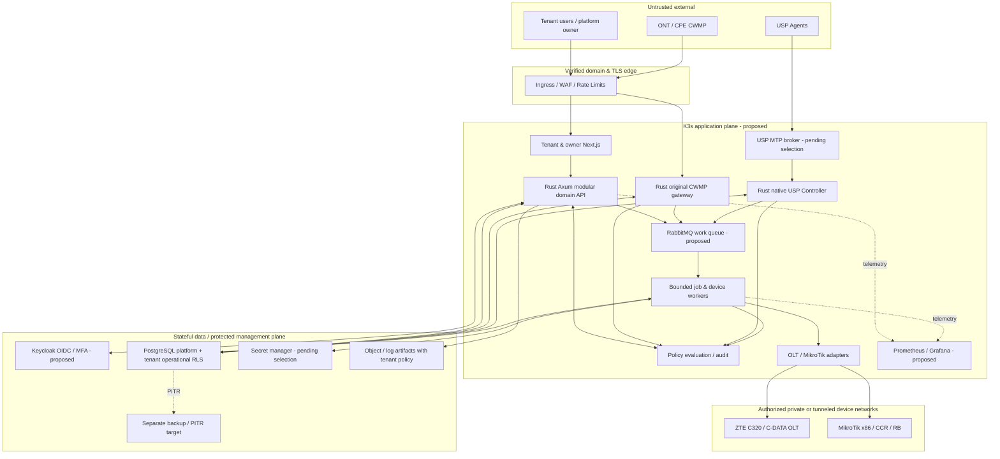
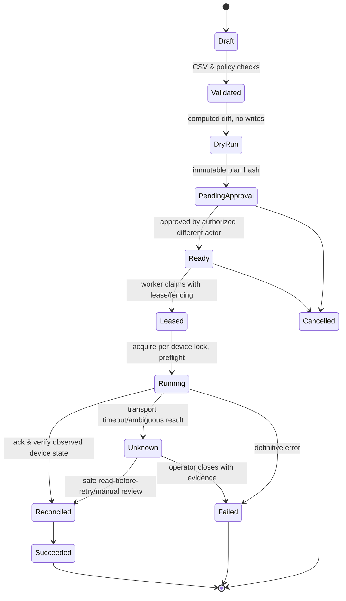

# IPAT — Technical Architecture v0.1

**Tanggal:** 2026-09-25 · **Status:** approved constraints + proposed implementation detail (lihat `DECISIONS.md`)  
**Cakupan:** MVP laboratorium → arsitektur komersial terukur. Ini **rancangan**, bukan bukti komponen sudah berjalan.

## 1. Architecture principles dan boundaries

1. Original Rust ACS CWMP server dan native Rust USP Controller adalah dua proses/protocol boundary berbeda; tidak menggunakan GenieACS sebagai engine. Shared `device-core` menyimpan identitas, capability dan job abstraction yang tidak berpura-pura kedua standar identik.
2. Business logic dimulai sebagai **modular monolith** Rust/Axum + deployable protocol services (`cwmp-gateway`, `usp-controller`) dan worker (`job-worker`); jangan membelah seluruh domain menjadi microservice.
3. Strong tenant context end-to-end: `auth subject + verified tenant membership + resource assignment + policy decision`. Tenant host/domain adalah *routing hint* yang diverifikasi di edge, bukan bukti otorisasi atau kepemilikan perangkat. Control plane platform dan data plane operasional tenant dipisahkan.
4. Retry adalah *at least once* transport; output perubahan perangkat tidak otomatis exactly once. Gunakan transactional outbox, idempotency, distributed lease/fencing dan `reconcile-before-retry`; unknown outcome → intervensi operator.
5. K3s menambah/mengurangi compute capacity lintas VPS/bare-metal heterogen. Stateful PostgreSQL HA dan object/backup storage adalah proyek berbeda. Scaling tidak berarti distribusi CPU sama atau kenaikan throughput linear.
6. Read-only sebelum write adapter; capability/validation per exact model+firmware+feature+protocol, approval dan audit pada write.

## 2. Context dan trust-boundary diagram



**Logical boundaries:** public HTTPS UI/API vs dedicated protocol ingress; authenticated MQTT transport proposed for USP; device-management egress restricted by tenant/device network allowlist; database and secret plane not exposed publicly; admin of platform and tenant interfaces are separate authz namespaces. Tenant dashboard subdomain contoh `kangnet.ipat.id`/`nengnet.ipat.id` adalah ilustrasi **tanpa asumsi kepemilikan domain**.

## 3. Repository & deployable units (planned; none claimed implemented)

```text
ipat/
├── README.md
├── Cargo.toml                          # Rust workspace
├── apps/
│   ├── control-api/                   # Axum business domain modular monolith
│   ├── cwmp-gateway/                  # original CWMP Rust HTTPS/SOAP server
│   ├── usp-controller/                # native USP protobuf/controller
│   └── job-worker/                    # poll outbox/consume queue, adapter execution
├── crates/
│   ├── tenant-core/                   # canonical verified TenantContext
│   ├── authz-core/                    # RBAC/ABAC policy evaluator
│   ├── device-core/                   # IDs, capabilities, normalized observations
│   ├── provisioning-core/            # state machine + approval + idempotency
│   ├── inventory-core/               # subscriber/topology model
│   ├── diagnostic-core/              # evidence and deterministic rules
│   ├── cwmp-protocol/                # SOAP/XML, CWMP state machine
│   ├── usp-protocol/                 # protobuf schema, MTP boundary
│   ├── adapters-zte/
│   ├── adapters-cdata/
│   ├── adapters-mikrotik/
│   ├── persistence/
│   └── observability/
├── web/                                # Next.js TypeScript (proposed)
├── migrations/                         # PostgreSQL + RLS + audit + outbox
├── proto/                              # reference-pinned USP schemas
├── tests/                              # unit, integration, policy-negative, e2e, sim, physical
├── deploy/
│   ├── compose/                        # lab only
│   ├── ansible/                        # Ubuntu/K3s bootstrap
│   ├── terraform/                      # optional supported providers
│   ├── helm/                           # app manifests, requests/limits
│   └── gitops/                         # desired state manifests
└── docs/                               # source of truth
```

**Shared crate ≠ single process:** identity/capabilities/policy API compiled into several Rust workloads, yet config boundaries enforce least-privilege service identities. Circular dependencies dilarang: protocol crates bergantung pada device-core/traits, bukan domain API HTTP; adapters mematuhi `DeviceAdapter` capability contract.

## 4. Tenant model, auth, routing dan database

### 4.1 Domain dan trust chain

1. Ingress menerima request hanya untuk domain pada `verified_tenant_domains`, sertifikat dan routing record yang dimiliki; perpanjangan sertifikat dan takeover prevention diuji. Header `Host`/`X-Forwarded-*` dianggap tidak terpercaya bila tidak diterbitkan trusted ingress.
2. Sesi OIDC JWT yang diverifikasi (`iss`, `aud`, signature, expiry/nbf, session context) → membership tenant pada DB/policy → `TenantContext` immutable (`tenant_id`, actor, scopes, POP, auth strength, correlation ID). User tidak dapat mengirim `tenant_id` bebas untuk menambah scope.
3. Domain mapping wajib konsisten dengan membership; cross-domain login harus memilih tenant melalui proses terotorisasi. Custom-domain cookie **host-only**, CSRF protected dan OIDC return URI allowlisted. UI menyembunyikan menu via server-supplied filtered entitlement, tetapi setiap endpoint/API/export/job tetap re-evaluate policy.
4. Platform owner bukan `super tenant`. Support access untuk tenant membutuhkan permintaan+approval scope/time-bound dan logging plus pemberitahuan sesuai kontrak; secret akses lebih ketat.
5. Service-to-service menggunakan mTLS/network policy bila dimungkinkan, service identity/audience terpisah serta signed tenant provenance (bukan semata queue payload); worker membaca job dari DB dan memverifikasi ulang resource+policy.

### 4.2 Candidate v0.1 tenant persistence — **PROPOSED ADR-005**

- PostgreSQL logical platform schema mengelola tenants, domains, plans, entitlements, operator grants. Tenant operational tables (`devices`, `observations`, `subscribers`, `topology_edges`, `jobs`, `incidents`, `audit_events`) memakai `tenant_id NOT NULL`, scoped FK dan indexes `(tenant_id, ...)`. Jangan memungkinkan relasi lintas tenant melalui foreign key ID global tanpa verifikasi.
- App connection pool memakai runtime role tanpa superuser/BYPASSRLS dan bukan owner; `ENABLE`+`FORCE ROW LEVEL SECURITY` di tiap tabel tenant. Transaction-scoped `SET LOCAL app.tenant_id = ...` hanya setelah membership diverifikasi, hindari leakage koneksi pool. RLS denial bila tenant setting tidak valid/absent. `SECURITY DEFINER` dipakai sangat terbatas dan diaudit.
- Simpan audit multi-tenant pada storage/log terfilter; `COPY`, exports, full-text search, derived materialized views, task payload dan restore punya tenant isolation sendiri. `pg_dump`/backup fisik mencakup banyak tenant: kontrol akses backup ketat, segment/restore/redaction setelah insiden dan opsi tenant-dedicated DB dievaluasi.
- Saat tenant skala besar atau isolasi kontrak mengharuskan, pertimbangkan migrasi tenant ke database/cluster khusus melalui storage abstraction & per-tenant routing. Kompleksitas migration/cost menjadi alasan pola shared+RLS masih *pending decision*.

**Indicative pseudocode** (bukan migration siap jalan):

```sql
-- Illustrasi: migrate menggunakan role khusus, runtime role terpisah.
ALTER TABLE tenant_devices ENABLE ROW LEVEL SECURITY;
ALTER TABLE tenant_devices FORCE ROW LEVEL SECURITY;
CREATE POLICY tenant_scope ON tenant_devices
  FOR ALL TO ipat_app_runtime
  USING (tenant_id = NULLIF(current_setting('app.tenant_id', true), '')::uuid)
  WITH CHECK (tenant_id = NULLIF(current_setting('app.tenant_id', true), '')::uuid);
-- DAL wajib SET LOCAL dari tenant context yang sudah diverifikasi, bukan header.
```

Uji *owner bypass*, `BYPASSRLS`, prepared statement/transaction pooling, invalid UUID handling dan `SET LOCAL` rollback. RLS tidak melindungi superuser/owner kecuali FORCE, serta operasi tertentu seperti TRUNCATE memerlukan kontrol GRANT terpisah.

### 4.3 Core data model (concept)

| Entitas | Kunci minimal | Invariant |
|---|---|---|
| `tenants` | `id`, `state`, `plan_id` | Hanya control-plane dapat membuat/menangguhkan |
| `tenant_domains` | `tenant_id`, `fqdn`, `verified_at`, `challenge_ref` | Unik secara global, mapping verified sebelum routing |
| `devices` | `id`, `tenant_id`, `kind`, `vendor`, `exact_model`, `firmware`, `status` | Identitas/credential dan ACS/USP agent harus terikat pada tenant |
| `device_protocol_identities` | `device_id`, `tenant_id`, `protocol`, `protocol_identifier`, `credential_ref` | Unique semantics scoped oleh tenant & protocol; collision ditolak |
| `capability_validations` | `vendor`, `model`, `firmware`, `protocol`, `feature`, `status`, `evidence_ref` | Tidak ada dukungan global hanya karena vendor cocok |
| `subscribers` | `id`, `tenant_id`, `customer_ref` | Data pelanggan adalah PII; akses per POP/subscriber |
| `topology_edges` | `tenant_id`, `from_id`, `to_id`, `source`, `observed_at` | Dua endpoint sama tenant; evidence dan freshness |
| `observations` | `tenant_id`, `device_id`, `metric`, `value`, `observed_at`, `ingested_at`, `source` | Bedakan source time vs ingest time, stale bukan offline pasti |
| `jobs` | `tenant_id`, `resource_id`, `state`, `idempotency_key`, `lease_owner`, `fencing_token`, `approval_id` | Unique scoped idempotency dan provenance |
| `outbox` | `tenant_id`, `event_id`, `payload_ref`, `published_at`, `attempts` | Commit pada transaksi yang sama dengan job |
| `approvals` | `tenant_id`, `requested_by`, `approved_by`, `scope_hash`, `expires_at` | Separation of duties, approval melekat pada diff immutable |
| `incidents/evidence` | `tenant_id`, `scope`, `hypothesis`, `sources`, `ages` | Hipotesis bukan fakta tanpa evidence |
| `audit_events` | `tenant_id` (nullable hanya platform operations), `actor`, `action`, `outcome`, `correlation_id` | Append-only/write restricted dan redacted |

Partisi telemetry/time-series dan alat eksternal belum dipilih; sebelum retensi panjang, ukur kapasitas PostgreSQL vs observability store serta backup blast radius.

## 5. Protocol details dan alur

### 5.1 ACS/CWMP TR-069 (native Rust)

- Axum HTTPS endpoint khusus protocol; validasi TLS, content type/size, secure XML parser (no DTD/external entities, entity limits), SOAP faults dan session timeouts. **TR-069 Amendment 6 Corrigendum 1** menjadi referensi standar yang *in force*; pilih subset RPC berdasarkan tes, jangan mengklaim implementasi seluruh amendment.
- CWMP Inform memuat identitas CPE/events, tetapi `SerialNumber`, MAC, remote IP, hostname atau realm saja bukan bukti tenant. Untuk perangkat pradaftar: kombinasi unique ID per manufaktur/OUI/ProductClass/serial dan credential auth/issued enrollment binding diverifikasi terhadap tenant. Collision/quarantine → tidak auto-assigned. Enrollment harus aman untuk perangkat yang belum mendukung metode ideal.
- State: authenticate → check device/tenant → open session/record Inform → InformResponse → schedule one eligible RPC following CWMP session rules → process response/fault → close/expire session. Distribusi session ownership antarpod harus desain eksplisit sebelum scaling ACS; jangan meletakkan koneksi aktif *hanya* pada DB.
- Feature baseline: Inform/InformResponse dan satu operasi parameter (misalnya GetParameterValues pada path yang **diuji**). Metode/versi/batasan dicatat di `DEVICE_MATRIX.md`, tidak hard-code path universal TR-098/TR-181 pada semua CPE.
- Control-plane `cwmp_inform_total`, session age, RPC failures per profile, concurrent sessions, invalid auth, queue latency. Connection Request/NAT/discovery upgrade dibahas setelah physical validation.

### 5.2 USP/TR-369 native Controller

- Modul sendiri (agent identifiers, controller identity, USP Record/Message protobuf, E2E correlation, replay/authorization, transport adapters) dan trait mapping ke normalized device model. Current reference target **TR-369 Amendment 5**; feature profile diputuskan ADR karena agen lab bisa implementasi amendment lebih lama.
- Initial MTP candidate MQTT yang diamankan dengan TLS, ACL topic per Controller/Agent dan credential/lifecycle; **MQTT broker dan RabbitMQ work queue adalah dua fungsi berbeda** walaupun produk mungkin berbagi teknologi bila dibuktikan aman. Broker/MTP tetap PROPOSED hingga threat test dan interoperability.
- Proof flow S1: synthetic/compatible Agent authenticated connect → Controller identification → Get atau Notification satu pesan → correlation dan observation → audit; jika simulator saja, tandai `simulator-only` dan jangan klaim device supports USP.
- Tenant binding datang dari trusted enrollment dan broker identity + per-agent mapping, bukan topic user-controlled. Session/reconnect/duplicate/out-of-order, schema evolution dan access control ditangani M1/M2.

### 5.3 OLT, MikroTik, ONT adapters

- Adapters exposed `discover()`, `observe()`, `capabilities()`, `plan_change()`, `execute_approved()`; write capability **default false**, bergantung evidence exact tuple model/firmware/feature dan privilege.
- OLT ZTE C320/C-DATA: SNMP dan vendor channel *candidate*, tentukan MIB/CLI/API berdasarkan akses nyata; telemetry read-only dulu. Jangan menyimpulkan semua OLT C-DATA/firmware sama. VSOL GPON OLT di luar confirmed pilot.
- MikroTik x86/CCR/RB/RB pelanggan: per RouterOS version pilih `api-ssl` atau REST over `www-ssl` jika tersedia; trust sertifikat dan allowlisted device subnets, credential tenant-specific; larang plaintext fallback di staging/production. PPPoE secret/session read scoped dan limited write.
- No unexpected high-risk commands; preview diff/rollback plan untuk per-command yang memungkinkan, emergency stop dan blast-radius caps (maks router/device/subscriber per batch) ditetapkan security policy.

## 6. Provisioning transaction/state machine dan side-effect safety



1. API transaction menyimpan immutable diff/plan hash, actor/approval dan job+outbox pada PostgreSQL atomik; outbox dispatcher publish minimal once dan mencatat ack tanpa menghapus provenance.
2. Worker menerima pesan berupa opaque `job_id` + correlation ID; mengambil job & resource/approval dari DB (jangan percaya tenant_id hanya dari queue). Claim atomik (`lease_owner`, expiry, monotonic `fencing_token`), per-device lock, max concurrency per adapter, per-router throttle.
3. Sebelum write: check policy+approval expiry/immutable plan hash, model/firmware exact capability, maintenance window dan current state; setelah write, verify state/sanitized evidence; `applied` hanya bila terverifikasi.
4. Worker yang lease-nya kedaluwarsa harus diblokir dari *commit state* via fencing token. **Catatan:** fencing DB tidak otomatis menghentikan perintah yang telanjur dikirim ke perangkat; pada timeout outcome `Unknown` perlu reconciliation/read-back/manual review untuk mencegah side-effect ganda. Klaim exactly-once end-to-end tidak sah tanpa dukungan transaction/idempotency perangkat.
5. RabbitMQ ack sesudah state durable; duplicate delivery mengarah ke pemeriksaan `idempotency_key` dan state, tidak mengirim perubahan ulang jika state sukses/sedang unknown. Dead-letter + incident pada retry limit, manual replay memerlukan otorisasi.

## 7. Diagnostics engine dan data provenance

Event input: physical/logical uplink status, OLT/PON/ONT signal/alarm, CPE Inform dan parameter, PPPoE active/error, router interface/counters, topology edges dan maintenance data. Normalizer simpan `source`, `observed_at`, `ingested_at`, `confidence_of_source`, `freshness_policy`, missingness dan contradictions.

**Rules baseline S1 (synthetic, bukan akurasi lapangan):**

- R-DIAG-01: distribusi uplink failed + lebih dari satu downstream device/subscriber terpengaruh → *distribution-path hypothesis*, timestamp bukti dan daftar dampak.
- R-DIAG-02: satu ONT optical LOS + uplink/neighbor sehat → *ONT/PON access hypothesis*; jangan menyatakan fiber putus tanpa corroboration.
- R-DIAG-03: PPPoE auth/session fails dengan optical/transport bukti normal → *router/PPPoE hypothesis* dan evidence.
- R-DIAG-04: hanya tidak ada CWMP Inform → status *insufficient evidence*, tidak boleh otomatis *fiber cut*.

Tampilan memisahkan observasi aktual vs inferensi, provenance/age dan severity serta memberi manual review; tuning prediksi tidak termasuk S1.

## 8. K3s & heterogeneous scale path

**Lab single node:** Ubuntu 26.04 LTS 16 vCPU, 64 GiB-class RAM, ~1 TB NVMe baseline *provisional* + backup eksternal. Docker Compose test optional (tidak dijadikan production HA). K3s single-server/dev untuk menguji charts/resource policy; database awal lokal/dev bukan HA.

**Second node:** Ansible OS prep → private VPN/link → K3s join with time-bound join secret (never Git) → label `node.kubernetes.io/instance-type`/capacity/role, requests & limits → pod/worker eligible schedule → drain/restore test. Control-plane join dan datastore options diputuskan berdasar jaringan, host diversity dan db architecture. Tidak menjanjikan distribusi CPU ideal.

**Scale signals:** queue depth **dan oldest age**, in-flight jobs, per-device concurrent slots, CPU/memory/network, DB connection/writes, CWMP sessions, USP agents broker load, instrumented p95 latencies. HPA untuk API bila terbukti stateless; KEDA untuk workers dari queue setelah ready/admission gate. Backpressure berupa bounded concurrency, tenant budgets, circuit breakers, dead-letter, global controls; autoscale tidak mengatasi bottleneck PostgreSQL/device rate limits.

**Production:** redundant ingress/control-plane, isolated DB primary/standby and PITR/backups; broker HA, secrets, metrics HA/retention and regional egress tested. Architecture dan harga final pascaukuran; heterogeneous VPS dapat berbeda CPU steal/I/O sehingga monitor allocatable, actual core performance dan noisy-neighbor.

## 9. Availability, disaster recovery, operations

| Plane | S1 design | Commercial requirement |
|---|---|---|
| App | Single-node K3s dev atau compose | Multi-node, anti-affinity, readiness/liveness, rolling deploy, graceful drain |
| Postgres | Single lab, per-run backups and actual restore | Separated primary/standby, failover tested, WAL archiving/PITR, offsite encrypted tested backups |
| Queues | RabbitMQ dev single | Durable jobs + outbox, HA design/alert, DLQ and replay runbook |
| USP MTP | Broker TBD simulator | MQTT broker redundancy if selected, identity/ACL/observability |
| Secrets | Dummy/secure dev store | External managed vault/KMS with rotation/revocation and audited read |
| GitOps | Planned manifests | Signed artifacts, reviewed deploy, rollout/rollback and config drift reporting |

Runbooks dalam `DEPLOYMENT.md`: bootstrap/join/validate/drain/remove/restore; backup validation, incident classification, compromised credential, per-tenant isolation incident dan emergency stop. **RPO/RTO mesti diusulkan lalu dibuktikan** sesuai plan komersial.

## 10. ADR dan hal belum ditetapkan

- `ADR-001..004` adalah binding brief (original ACS, native USP, architecture form, Ubuntu/Rust/K3s).
- `ADR-005` shared operational PostgreSQL + RLS versus schema/database-per-tenant: **PROPOSED**, pilot security/load test diperlukan.
- `ADR-006` Next.js/Keycloak/RabbitMQ/Prometheus/Grafana: **PROPOSED** component bundle, review dependencies/licensing/deployment cost.
- `ADR-007` USP MQTT MTP and broker: **PROPOSED**; validate A5 feature subset/agent versions/security.
- `ADR-008` secret manager/object storage/telemetry partitions/data retention: **OPEN**.
- `ADR-009` high-risk approvals, domain trust model and separation of platform control plane: constraint approved; workflow detail **PROPOSED**.
- `ADR-010` PostgreSQL HA/failover/RPO/RTO and secondary-region backups: requirement approved, topology/vendor values **OPEN**.

## 11. Reference versions and external technical references (checked 2026-09-25)

- [Broadband Forum technical library — TR-069 Amendment 6 Corrigendum 1 *in force*](https://www.broadband-forum.org/technical-library/?Type%5B0%5D=Technical+Report&sort=InForce&type=asc); protocol subset must be enumerated in tests.
- [Broadband Forum technical library — TR-369 Amendment 5 *in force*](https://www.broadband-forum.org/technical-library/?number=TR-369); [USP official repository v1.5 release metadata](https://github.com/BroadbandForum/usp/blob/master/PROJECT.yaml).
- [Broadband Forum technical library — TR-181i2a21 (2026/06)](https://www.broadband-forum.org/technical-library/) as data model reference, not a claim of agent capability.
- [Ubuntu 26.04 LTS release notes](https://documentation.ubuntu.com/release-notes/26.04/).
- [PostgreSQL RLS documentation](https://www.postgresql.org/docs/current/ddl-rowsecurity.html): FORCE RLS and owner/superuser/BYPASSRLS caveats.
- [MikroTik RouterOS REST API documentation](https://manual.mikrotik.com/docs/developer-guides/rest-api/) and [RouterOS API](https://manual.mikrotik.com/docs/developer-guides/api/)—feature availability must be measured per device/RouterOS.
- [KEDA scaling deployments reference](https://keda.sh/docs/2.21/concepts/scaling-deployments/). Pin actual versions during implementation with SBOM and compatibility tests.

**Verification reminder:** Referensi menjelaskan standar/platform fitur yang tersedia, **tidak** membuktikan keberhasilan implementasi IPAT maupun kompatibilitas fisik OLT/ONT/MikroTik.
